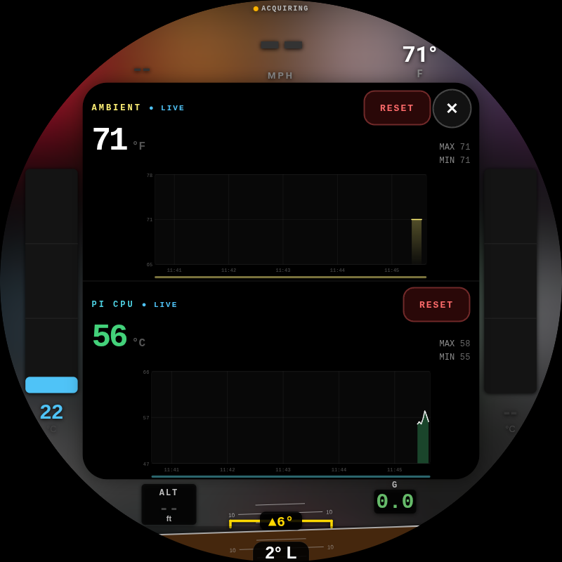
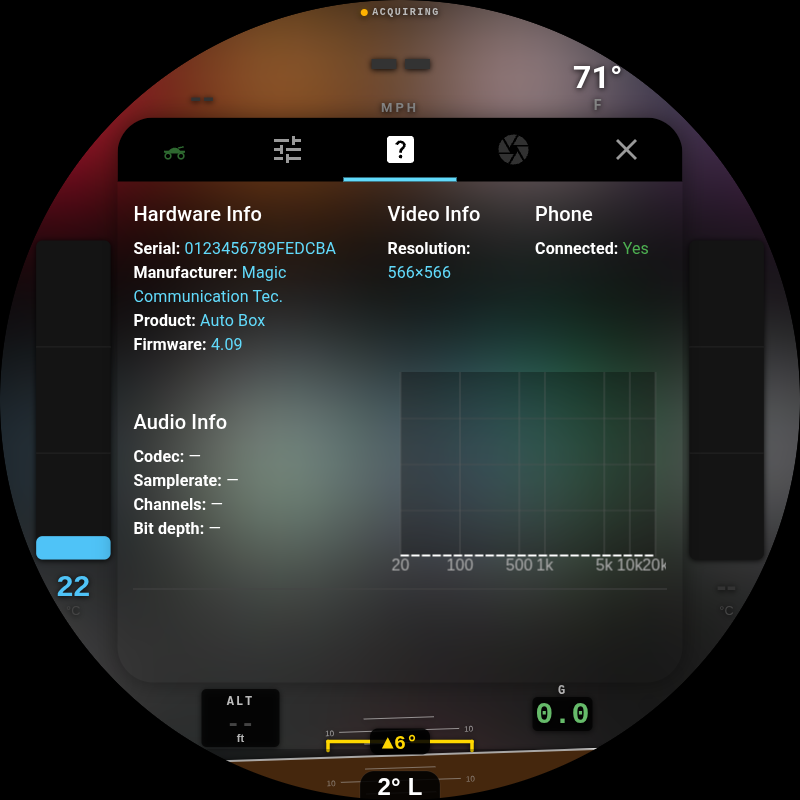

<p align="center">
  <a href="https://byronthegreat.com/projects/motocarplay/"></a>
  
  
  
</p>

# motoCarPlay

**A round-display Apple CarPlay dashboard with live motorcycle instrumentation, built for a 1976 BMW R75/6.**

**▶ Try the live browser demo → [byronthegreat.com/projects/motocarplay](https://byronthegreat.com/projects/motocarplay/)**
_(the dashboard UI running in your browser, driven by a simulated ride; the center CarPlay screen is a static screenshot)_

CarPlay runs in a centered square on an 800×800 round screen. The curved space
around it shows sensor data read straight off the bike: cylinder-head temps,
lean/pitch/G, GPS speed and heading, ambient and Pi temperature. A blurred
backdrop bleeds the on-screen color out to the bezel.

<p align="center">
  
</p>

> 📷 _On-bike photos of the display mounted in the R75/6 dash coming soon._
<!-- Add real mounted/riding photos here, e.g. documentation/images/bike-01.jpg -->

> **This is a personal build.** It's a hard fork of
> [OneMakerShow/round-carplay](https://github.com/OneMakerShow/round-carplay)
> (itself based on [pi-carplay](https://github.com/f-io/pi-carplay)), rewritten
> around discrete sensors instead of an OBD/CAN bus. The R75/6 has no OBD port,
> so every reading comes from a sensor wired to the Pi. Full credit for the base
> CarPlay engine goes to those upstream projects.

---

## What it does

### CarPlay, centered in the circle

Wireless CarPlay (via a Carlinkit adapter) renders in a **565×565px** square with
a rounded card and soft outer shadow. The Waveshare 3.4″ panel is 800×800, so 565
is the largest square that fits inside the circle. The four curved segments around
it are the instrument cluster:

| Arc | Shows (left to right) |
|---|---|
| **Top** | Compass heading · GPS speed (mph) · ambient temperature (tap → graph) |
| **Bottom** | Altitude · lean-angle inclinometer + pitch · G-force |
| **Left / Right** | Cylinder-head temperature, one bar gauge per jug, color-coded by heat |

### Ambient blurred backdrop

Instead of black around the square, motoCarPlay samples the live CarPlay frame,
downscales it, and paints a blurred, scaled-up copy across the round display.
It's the same trick used to letterbox vertical video. Each frame eases onto the
last one so the glow flows softly instead of strobing when something colorful
scrolls by. It's a one-tap toggle in Settings (**BACKDROP**) and costs almost
nothing; the sample runs at ~10 fps on a tiny canvas.

You can see the warm glow bleeding into the bezel in every screenshot here.

### Live graphing with risk zones

Tap any metric to open a full-screen graph over the CarPlay card: a big live
number, rolling **MIN / MAX**, a **RESET**, and a scrollable history. Graphs that
matter for engine/board health get **color risk bands** painted under the trace:

| Metric | Bands |
|---|---|
| **Cylinder-head temp** | cold (blue) → normal (green) → warm (amber) → hot (red) |
| **Pi CPU temp** | healthy (green) → warm (amber) → throttle (red) |

Tap the **ambient** reading and the screen splits into a **dual graph**: ambient
on top, **Pi CPU temperature** below. The Pi runs in a sealed case, so the CPU
trace shows its thermal headroom at a glance.

<p align="center">
  
  &emsp;
  
</p>

### Keeps the right time without WiFi

A Pi has no clock when it's powered off. Two things fix that. The **Pi 5 RTC
battery** holds the time across power-off, so the clock is right at boot with no
network. As a backup, `gps.py` sets the system clock from GPS UTC on the first
valid fix when the time is badly off, so the dash stays correct even after days
with no cell or WiFi. See
[`PI_SETUP.md`](PI_SETUP.md#gps-clock-set-no-wifi-time-fix) for details.

---

## Parts list

Everything connects to the Pi's GPIO or USB. Prices are what I actually paid
(USD); yours will vary.

### Compute & display

| Part | What I used | Qty | Price |
|---|---|--:|--:|
| Pi 5 (2GB) + active cooler + case | iRasptek Basic Kit for Raspberry Pi 5 (2GB) | 1 | $110.99 |
| microSD card | SanDisk Extreme PRO 32GB (A1 / U3 / V30) | 1 | $31.99 |
| Round touchscreen | Waveshare 3.4″ HDMI Round, 800×800 IPS, 10-pt touch | 1 | $105.99 |
| Enclosure | 3D-printed Pi case + display back (own filament) | 1 | DIY |

### CarPlay

| Part | What I used | Qty | Price |
|---|---|--:|--:|
| Wireless CarPlay adapter | Carlinkit **CPC200-CCPA** | 1 | $55.99 |

### Sensors

| Part | What I used | Qty | Price |
|---|---|--:|--:|
| GPS receiver | Adafruit Ultimate GPS GNSS w/ USB (99-ch, 10 Hz) | 1 | $29.95 |
| GPS antenna | Adafruit External Active Antenna, 28 dB, 5 m, SMA | 1 | $21.50 |
| Antenna pigtail | u.FL → SMA RG178 jumper (5-pack, used 1) | 1 | $6.99 |
| GPS backup cell | CR1220 coin cell (GPS module almanac, faster warm fix) | 1 | $2.49 |
| IMU (lean / pitch / G) | Adafruit **BNO055** 9-DOF (UART mode) | 1 | $39.10 |
| Ambient temp | BOJACK **DS18B20** waterproof probe kit (incl. pull-up) | 1 | $8.99 |
| CHT amplifier | Adafruit **MAX31856** universal thermocouple board | 2 | $23.84 |
| CHT thermocouple | K-type probe w/ **14 mm** spark-plug washer, 3 m lead | 2 | $31.98 |

### Real-time clock

| Part | What I used | Qty | Price |
|---|---|--:|--:|
| RTC battery | ML2032 rechargeable Li coin cell | 1 | $8.99 |
| RTC holder | RTC battery box for Pi 5 (cell not included) | 1 | $5.49 |

### Cabling & adapters

| Part | What I used | Qty | Price |
|---|---|--:|--:|
| Jumper wires | 120-pc Dupont kit (M-F / M-M / F-F) | 1 | $8.99 |
| HDMI cable | Cable Matters ultra-thin HDMI, 6 ft (2-pack, used 1) | 1 | $15.99 |
| HDMI right-angle | 180° HDMI M-F U-shaped adapter (2-pack, used 1) | 1 | $10.99 |
| Micro-HDMI adapter | Micro-HDMI M → HDMI F 180° angled (2-pack, used 1) | 1 | $9.99 |
| USB-C → USB-A cable | Amazon Basics, 6 ft | 1 | $2.82 |

**Parts subtotal: ≈ $533** (+ $13.84 Adafruit shipping & tax on the GPS order).
Excludes the 3D-printed enclosure (own filament) and the iPhone you already own.

> **Why these specific parts:**
> - The R75/6 takes **14 mm** spark plugs, so the thermocouple washers are 14 mm.
> - The **BNO055 runs over UART, not I2C**. I had trouble with it on I2C.
>   (Details in `sensors/imu.py`.)
> - The Waveshare panel is **HDMI**, so the Pi 5's micro-HDMI is adapted to it.
>   That's the little stack of HDMI adapters above.

---

## Instrument wiring & Pi setup

Full reproduce-from-a-fresh-flash instructions live in
**[`PI_SETUP.md`](PI_SETUP.md)**: `config.txt` overlays, sensor wiring pinouts,
udev rules, the systemd user services, and the gotchas learned the hard way.

Sensor scripts (`sensors/*.py`) each document their exact wiring in the file
header. Quick map:

| Sensor | Script | Bus |
|---|---|---|
| BNO055 IMU (lean/pitch/G) | `imu.py` | UART `/dev/ttyAMA0` |
| CHT left/right (MAX31856 ×2) | `cht_temp.py` | SPI0 (CE0 = left, CE1 = right) |
| Ambient (DS18B20) | `ambient_temp.py` | 1-Wire (GPIO4) |
| GPS (Adafruit Ultimate, USB) | `gps.py` | USB serial `/dev/gps` |
| Pi CPU temp | `pi_temp.py` | `/sys/class/thermal` (no wiring) |

---

## Build & deploy the app

### Prerequisites (build host)

- **Node** (project uses electron-vite) and **Python 3.x** (for native module builds)
- **build-essential**, **libusb-1.0-0-dev**, **libudev-dev** (Linux)
- **fuse** (to run the AppImage)

### Build the arm64 AppImage

```bash
npm run install:clean
npm run build:armLinux      # → dist/round-carplay-0.1.0-arm64.AppImage
```

> ⚠️ electron-builder rewrites the root `package.json` during packaging. **Always
> restore it afterward** or the next build can ship a broken app:
> ```bash
> git checkout -- package.json
> ```
> (See [`CLAUDE.md`](CLAUDE.md) for the full footgun writeup.)

### Deploy to the Pi

```bash
rsync -az --progress "dist/round-carplay-0.1.0-arm64.AppImage" \
  byron@motocarplay.local:/home/byron/round-carplay/round-carplay.AppImage
ssh byron@motocarplay.local "sudo reboot"
```

The Pi autostarts the AppImage on boot; the sensor scripts run as systemd user
services. The app and the Python sensors talk over a local Socket.IO channel.

---

## Settings reference

Open Settings via the tuning icon. Video/stream changes need **Save** (which
resets the dongle); most other toggles apply immediately.

<p align="center">
  
  &emsp;
  
</p>

### Video & stream

| Setting | Typical | What it does |
|---|---|---|
| **WIDTH / HEIGHT** | 565 × 565 | Resolution sent to the phone; CarPlay renders its UI at this size. It's the largest square inside the 800×800 Waveshare circle. |
| **FPS** | 60 | Frames per second requested from the phone. |
| **DPI** | 140 | UI scaling hint to the phone. Higher = denser. |
| **FORMAT** | 5 | Video codec (5 = H.264). |
| **IBOX VERSION** | 2 | Carlinkit protocol version (works for CPC200-CCPA). |
| **MEDIA DELAY** | 500 ms | Audio start delay, for A/V sync. |
| **PHONE WORK MODE** | 2 | Connection mode (2 = wireless CarPlay). |

### Toggles & audio

| Control | What it does |
|---|---|
| **KIOSK** | Hides the nav tabs for a pure-dashboard look. |
| **DARK MODE** | Tells CarPlay to use its night theme. |
| **NO AUDIO** | Hands audio processing back to the phone (troubleshooting). |
| **BACKDROP** | Enables/disables the ambient blurred backdrop. |
| **SAMPLE DATA** | Feeds synthetic sensor values for UI testing on the bench. |
| **AUDIO / NAV VOL** | Separate volume for media vs. turn-by-turn voice. |
| **MICROPHONE** | Source for Siri/voice: OS (USB mic) or BOX (dongle mic). |
| **WIFI TYPE** | 2.4 / 5 GHz band the dongle broadcasts for wireless CarPlay. |
| **TILT CALIBRATION** | Zero the lean/pitch readout. Sit the bike level, then **SET LEVEL**. |
| **BINDINGS** | Map GPIO buttons to CarPlay controls (select, d-pad, home, etc.). |

---

## Disclaimer

_Apple and CarPlay are trademarks of Apple Inc. This project is not affiliated
with or endorsed by Apple. All trademarks are the property of their respective
owners. Mounting a screen on a motorcycle and reading it while riding is done at
your own risk. Keep your eyes on the road._

## Credits

- Base CarPlay engine: [OneMakerShow/round-carplay](https://github.com/OneMakerShow/round-carplay)
- Original project: [pi-carplay](https://github.com/f-io/pi-carplay)

## License

MIT. See [`LICENSE`](LICENSE).
